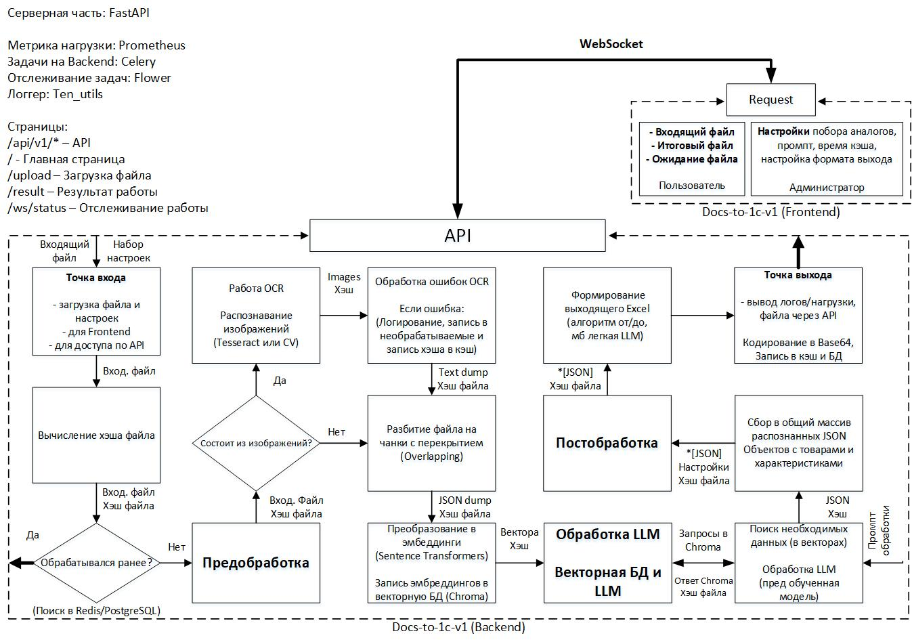

# **Documentation**
## **Быстрый старт**

---
## **1. Общая информация**  

**Название проекта:** Docs-to-1C-v1  
**Цель:** Разработка модуля для обработки тендерных документов (Word, Excel, PDF), их структурирования и формирования итогового файла Excel.  
**Формат работы:** Асинхронная обработка через API с WebSocket-уведомлениями и графическим интерфейсом на React.  
**Интеграция:** Встраивание в большую систему в виде независимого модуля.  

## **2. Архитектура проекта**  

- **Backend**: FastAPI  
- **Очереди задач**: Celery  
- **Мониторинг очередей**: Flower  
- **База данных**: PostgreSQL  
- **Кеширование**: Redis  
- **Векторная БД**: Chroma (или FAISS)  
- **Логирование**: ten_utils  
- **WebSocket**: для отслеживания статуса обработки  
- **Frontend**: React (с использованием React Router)

## **3. Основные компоненты системы**  

### **3.1 Backend (FastAPI)**  

#### **3.1.1 API маршруты**  
- `/api/v1/docs-processing/upload` - загрузка файла  
- `/api/v1/docs-processing/process` - запуск обработки  
- `/api/v1/docs-processing/result` - получение результата (готовый Excel)  
- `/api/v1/docs-processing/ws/status` - WebSocket для уведомлений о статусе обработки  

#### **3.1.2 Функционал API**  
- Принимает входной файл **(.docx, .xlsx, .pdf)**  
- Проверяет **кеш в Redis** (если файл ранее обрабатывался)  
- Если файла **нет в кеше**, вычисляет **хеш документа** и проверяет **PostgreSQL**  
- Если файл **уже был обработан**, **извлекает готовый Excel из БД**  
- Если **новый файл** → разбивает на **чанки (Overlapping)** и **запускает обработку**  

### **3.2 Очереди задач (Celery)**  
- Запуск **долгих операций**:  
  - OCR (если документ содержит изображения)  
  - Векторизация текста (Sentence Transformers)  
  - Анализ данных LLM  
  - Формирование финального Excel  
- **Мониторинг очередей через Flower**  

### **3.3 Кеширование и хранение данных**  
- **Redis (2 часа хранения)** – хранит **промежуточные данные (JSON-чанки)**  
- **PostgreSQL (30 дней хранения)** – сохраняет **готовые результаты обработки**  
- **Chroma / FAISS** – хранит **векторные представления чанков для быстрого поиска**  

### **3.4 Обработка LLM (Gemma 2B)**  
- Разделение данных на чанки (512-1024 токенов)  
- Генерация эмбеддингов (Sentence Transformers)  
- Поиск релевантных данных в Chroma / FAISS  
- Передача релевантных данных в LLM  
- Формирование структурированного JSON (товары + характеристики)  

### **3.5 WebSocket (отслеживание статуса обработки)**  
- React отправляет запрос на обработку файла  
- Backend отправляет статус в WebSocket (`processing`, `done`, `error`)  
- React обновляет UI в реальном времени  

## **4. Frontend (React + WebSocket)**  
- Использует `react-router-dom` для маршрутизации  
- Отправляет JSON-запросы на API  
- Использует WebSocket для статуса обработки  
- Поддерживает загрузку файлов с прогресс-баром  

### **4.1 Маршруты React**  
- `/docs-processing/` - главная страница модуля  
- `/docs-processing/status` - мониторинг обработки  
- `/docs-processing/result` - выгрузка результата  

## **5. Очистка данных и логирование**  
- Очистка Redis через 2 часа  
- Удаление данных из PostgreSQL через 30 дней  
- Логирование запросов (ten_utils + Prometheus)

## **6. Итоговая архитектура**
- **Backend (FastAPI)**
  - API (`/api/v1/docs-processing/...`)
  - Очереди (Celery + Flower)
  - LLM (Gemma 2B)
  - Векторная БД (Chroma/FAISS)
  - Кеширование (Redis)
  - Долговременное хранение (PostgreSQL)
- **Frontend (React)**
  - JSON-запросы на API
  - WebSocket для статуса
  - Интерфейс загрузки файлов и получения результата  

## **7. Финальный вывод**
- **Система поддерживает автономную обработку каждого документа**  
- **API логически разделено на `/upload`, `/process`, `/result`**  
- **Используется WebSocket для live-обновления статуса**  
- **Все данные кешируются в Redis, а готовые файлы сохраняются в PostgreSQL**  
- **Frontend полностью изолирован и общается через API**  